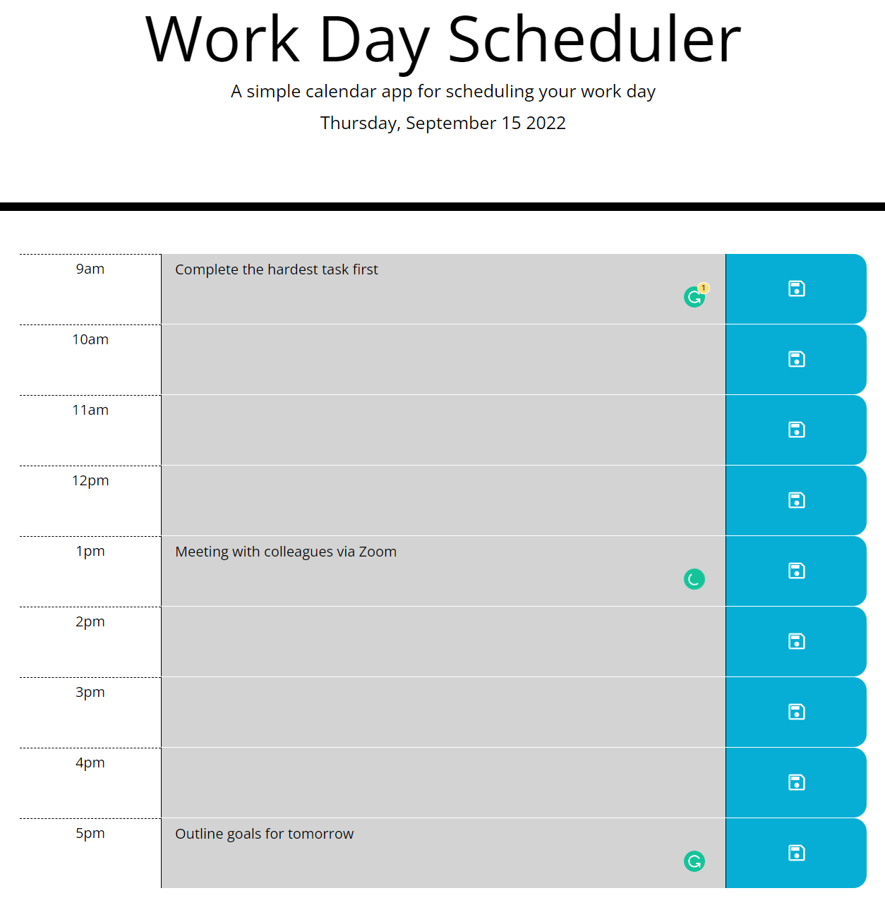

# Work Day Scheduler

## Description

This application allows you to enter in your schedule for the day.

Utilising local storage the user can save their tasks to the application. Helping them achieve everything they need to each day.

The time blocks will be displayed green if they time is in the future. 

If they are using it during the typical work hours the current hour will be have a red background.

Finally if the time is in the past it will be greyed out. As seen in the screenshot below. 

## Usage

Link to the final product: [Work Day Scheduler](https://andrew60199.github.io/day-scheduler-01/)

Above is a screenshot of the first application after the typical work hours.

## Licences

Refer to the 'LICENSE' file 